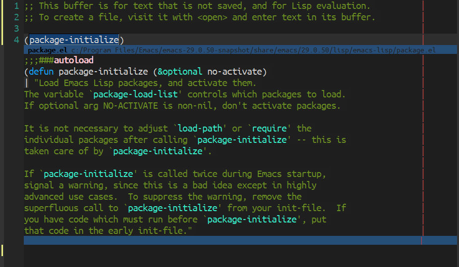

# quick-peek

An inline pop-up library for Emacs Lisp.

## API

See the docstrings of `quick-peek-show` and `quick-peek-hide`.

Complex programs may need to use the lower-level `quick-peek-overlay-ensure-at`, `quick-peek-overlay-contents`, and `quick-peek-overlay-update` methods.

## Customization

See docstrings of `quick-peek-background-face`, `quick-peek-border-face`, and
`quick-peek-padding-face`.

## Changes

